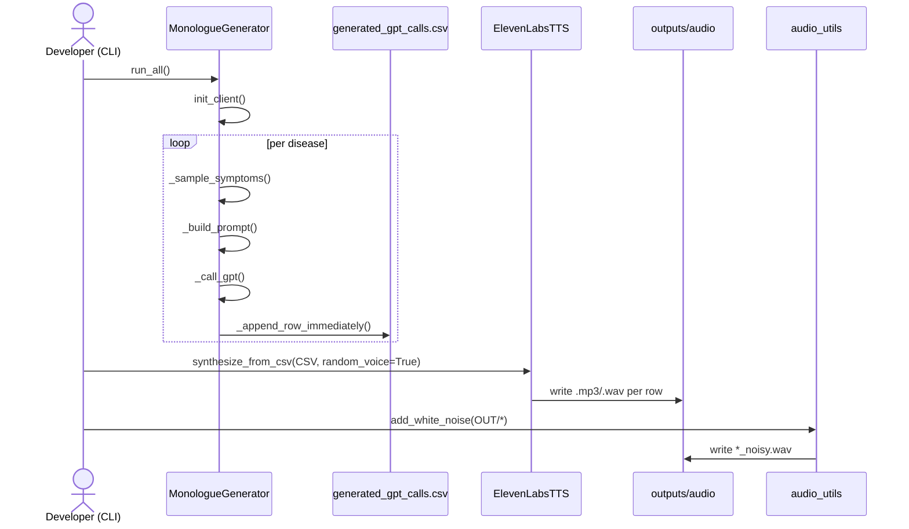
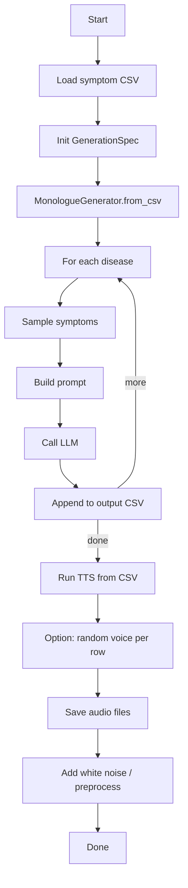

# ResQme – Class & UML Maps

**Source analyzed:** `/mnt/data/ResQme 2.zip` → `ResQme/`

---

## 1) High‑level pipeline (what calls what)

1. **LLM generation**
   - `scripts/llm/generate_with_openai.py` → `OpenAIScript.run()` → writes CSV of monologues.
   - `scripts/llm/generate_with_tinyllama.py` → `TinyLlamaScript.run()` (same idea, TinyLlama back‑end).
2. **TTS synthesis (audio)**
   - `scripts/tts/tts_elevenlabs.py` (CLI) → `ElevenLabsTTS` methods: list voices / add voice / synthesize from CSV.
   - `scripts/tts/tts_google.py` (CLI) → `TTSScript.run()` (Google TTS adapter).
3. **Audio post‑processing**
   - `scripts/audio/add_noise.py` → `audio_utils.add_white_noise()` to make noisy variants.
   - `scripts/audio/preprocess_audio.py` → `audio_preprocess.to_wav()` to normalize/convert.
4. **Shared configuration**
   - `src/resqme/config.py:Paths` centralizes default locations (raw CSV, outputs folders).

---

## 2) Class inventory (attributes + key methods)

### `src/resqme/config.py`
- **class `Paths`**  
  *Fields:* `raw_csv`, `outputs_root`, `out_monologues`, `out_audio`, `out_audio_noisy`  
  *Role:* Central place for default paths, loading from `.env` if present.

### `src/resqme/pipelines/llm/generate_monologues.py`
- **@dataclass `GenerationSpec`**  
  *Fields:* `symptom_csv`, `out_csv`, `num_calls_per_disease`, `symptoms_per_call`, `max_diseases`, `seed`, `model`, `temperature`, `max_tokens`, `delay_seconds`, `max_retries`, `retry_backoff`, `verbose`  
  *Role:* All knobs for monologue generation.
- **class `MonologueGenerator`**  
  *Fields:* `symptom_df`, `spec`, `client`, `out_path`, `header`  
  *Key methods:* `from_csv()`, `init_client()`, `diseases()`, `_build_prompt()`, `_call_gpt()`, `_present_symptoms_for()`, `_sample_symptoms()`, `_append_row_immediately()`, `generate_for_disease()`, `run_all()`  
  *Role:* Orchestrates sampling symptoms per condition, calling the LLM, and appending results directly to the output CSV.

### `src/resqme/pipelines/llm/openai_adapter.py`
- **class `OpenAIScript`**  
  *Fields:* `extra_globals`  
  *Key methods:* `run()` (executes the embedded original OpenAI script in a sandboxed namespace; returns `SimpleNamespace` of artifacts).

### `src/resqme/pipelines/llm/tinyllama_adapter.py`
- **class `TinyLlamaScript`**  
  *Fields:* `g`, `code`  
  *Key methods:* `__init__()`, `run()` (same adapter pattern as OpenAI, for TinyLlama flow).

### `src/resqme/pipelines/llm/data_adapter.py`
- **class `DataScript`**  
  *Fields:* `extra_globals`  
  *Key methods:* `run()` (executes embedded data‑prep script; adapter facade).

### `src/resqme/pipelines/tts/elevenlabs_tts.py`
- **class `ElevenLabsTTS`**  
  *Fields:* `api_key`, `base_url`, `voices`, `uid`, `text`, `speech`, `speech_bytes`, `sfx`, `sfx_bytes`, `url` (plus helper state), `voices` cache/CSV handling  
  *Key methods:* `_headers()`, `list_voices()`, `add_voice()`, `add_samples()`, `synthesize_text()`, `synthesize_from_csv()`, `synthesize_with_sfx()`  
  *Role:* Thin wrapper over ElevenLabs API for listing voices, adding samples/voices, and batch synthesis from the generation CSV.

### `src/resqme/pipelines/tts/tts_adapter.py`
- **class `TTSScript`**  
  *Fields:* `extra_globals`  
  *Key methods:* `run()` (executes embedded Google TTS script).

### Audio utilities
- **module `src/resqme/pipelines/audio/audio_utils.py`**  
  *function:* `add_white_noise(wav_path, out_path, snr_db=15.0)` → writes new noisy WAV file.  
- **module `src/resqme/pipelines/audio/audio_preprocess.py`**  
  *function:* `to_wav(in_path, out_path=None, target_sr=16000, mono=True, normalize=True)` → converts/normalizes with pydub/ffmpeg.

---

## 3) Class Diagram (Mermaid)

```mermaid
classDiagram
    class Paths {
      +str raw_csv
      +str outputs_root
      +str out_monologues
      +str out_audio
      +str out_audio_noisy
    }

    class GenerationSpec {
      +str symptom_csv
      +str out_csv
      +int num_calls_per_disease
      +int symptoms_per_call
      +int? max_diseases
      +int? seed
      +str model
      +float temperature
      +int max_tokens
      +float delay_seconds
      +int max_retries
      +float retry_backoff
      +bool verbose
    }

    class MonologueGenerator {
      -DataFrame symptom_df
      -GenerationSpec spec
      -Any client
      -Path out_path
      -list~str~ header
      +from_csv(path, spec) MonologueGenerator
      +init_client()
      +diseases() list~str~
      +_build_prompt(disease, symptoms) str
      +_present_symptoms_for(disease) str
      +_sample_symptoms(disease) list~str~
      +_call_gpt(prompt) str
      +_append_row_immediately(row)
      +generate_for_disease(disease)
      +run_all()
    }

    class OpenAIScript {
      -dict extra_globals
      +run() SimpleNamespace
    }

    class TinyLlamaScript {
      -dict g
      -str code
      +run() SimpleNamespace
    }

    class DataScript {
      -dict extra_globals
      +run() SimpleNamespace
    }

    class ElevenLabsTTS {
      -str api_key
      -str base_url
      -DataFrame voices
      -bytes speech_bytes
      -bytes sfx_bytes
      +_headers(accept, content_type) dict
      +list_voices(save_csv)
      +add_voice(name, description)
      +add_samples(voice_id, files)
      +synthesize_text(text, voice_id, model_id, stability, similarity_boost, style, speaker_boost)
      +synthesize_from_csv(csv, voice_id, voices_csv, output_dir, text_col, id_col, random_voice)
      +synthesize_with_sfx(text, sfx_path, mix_db)
    }

    class TTSScript {
      -dict extra_globals
      +run() SimpleNamespace
    }

    Paths <.. MonologueGenerator : uses
    GenerationSpec <.. MonologueGenerator : config
    OpenAIScript <.. MonologueGenerator : optional
    TinyLlamaScript <.. MonologueGenerator : optional
    MonologueGenerator --> "CSV" ElevenLabsTTS : input
    ElevenLabsTTS --> "audio files" : output
```

---

## 4) End‑to‑end flow (Sequence Diagram)



---

## 5) Control‑flow overview (Activity Diagram)



---

## 6) File‑level map (where the entry points are)

- `scripts/llm/generate_with_openai.py` → **entry point** for OpenAI flow (calls `OpenAIScript.run`).
- `scripts/llm/generate_with_tinyllama.py` → **entry point** for TinyLlama flow (calls `TinyLlamaScript.run`).
- `scripts/tts/tts_elevenlabs.py` → **entry point** for ElevenLabs CLI (subcommands: `list`, `add-voice`, `add-sample`, `say`, `csv`).
- `scripts/audio/add_noise.py` → batch add noise to folder.
- `scripts/audio/preprocess_audio.py` → convert/normalize audio files.

---

## 7) Notes & gotchas (from the code)

- `MonologueGenerator` appends rows **immediately** to disk to avoid losing data on crash; CSV header is created if missing.
- `OpenAIScript` / `TinyLlamaScript` / `TTSScript` use the same **adapter** pattern: embed the original script as a raw string and `exec()` in an isolated namespace. This keeps your historical scripts intact but gives them a class shell and a `run()` method.
- `ElevenLabsTTS.synthesize_from_csv(...)` supports **fixed voice** (`--voice-id`) or **random voice** from a `voices.csv` you can export with `list_voices --save-csv`.
- `audio_preprocess.to_wav(...)` requires **ffmpeg** via pydub; ensure it is installed and on PATH.
- Paths come from `Paths` dataclass; `.env` is loaded automatically in `config.py`.

---

## 8) How to extend safely

- If you add a new backend (e.g., Azure OpenAI), follow the adapter pattern → `AzureScript.run()` + thin CLI.
- Keep `GenerationSpec` the single source of truth for generation parameters.
- Prefer writing intermediate artifacts to `outputs/` (already standardized in `Paths`).
- For traceability, keep `MonologueGenerator`’s **append‑to‑CSV** approach; do not buffer all rows in RAM.

