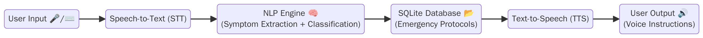

# ResQme – Emergency Event Detection Assistant  

ResQme is my Final Project for the B.Sc. in Industrial Engineering & Management at Afeka College.  
It is an offline-first assistant that helps detect and classify emergency medical situations in real time, and provides first-aid instructions to non-professionals.  

## ✨ Features  
- **Speech recognition (STT):** process spoken input in Hebrew.  
- **Text processing (NLP):** extract symptoms and match them to medical contexts.  
- **Voice output (TTS):** guide users with step-by-step instructions.  
- **Offline-first:** designed to work even without internet connection.  
- **SQLite database:** store emergency protocols locally.  

## 🛠️ Tech Stack  
- **Languages:** Python  
- **Libraries:** Pandas, scikit-learn, SpeechRecognition, ElevenLabs TTS, Google TTS  
- **Database:** SQLite  
- **Other:** Git, VS Code, PyCharm  

## 📂 Repository Structure (work in progress)  
```

ResQme/
│
├── src/                # main source code
│   ├── ingestion/      # data collection & preprocessing
│   ├── nlp/            # text classification & keyword extraction
│   ├── tts/            # text-to-speech modules
│   ├── stt/            # speech-to-text pipeline
│   └── ui/             # simple interface / demo
│
├── notebooks/          # data exploration & prototyping
├── docs/               # diagrams, slides, screenshots
├── requirements.txt    # dependencies
└── README.md           # project description


## 🚀 How to Run (basic demo)  
1. Clone the repo:  
   ```bash
   git clone https://github.com/AvivBachana/Code
   cd Code
````

2. Install dependencies:

   ```bash
   pip install -r requirements.txt
   ```
3.  a demo script (example – TTS):

   ```bash
   python src/tts/tts_elevenlabs.py
   ```

## 📖 Status

This project is **still in progress** – I am currently finalizing the NLP and speech modules.
The goal is to deliver a working prototype that demonstrates real-time emergency detection and guidance.

## 📸 Screenshots & Diagrams

### System Architecture



### User Interface Mockup


### Data Flow Example


## 👩‍💻 About Me

I am a 3rd-year Industrial Engineering & Management student, majoring in Business Intelligence & Information Systems.
I enjoy programming, learning new technologies, and developing data-driven solutions.
[LinkedIn](https://www.linkedin.com/in/aviv-bachana/) | [GitHub](https://github.com/AvivBachana)
